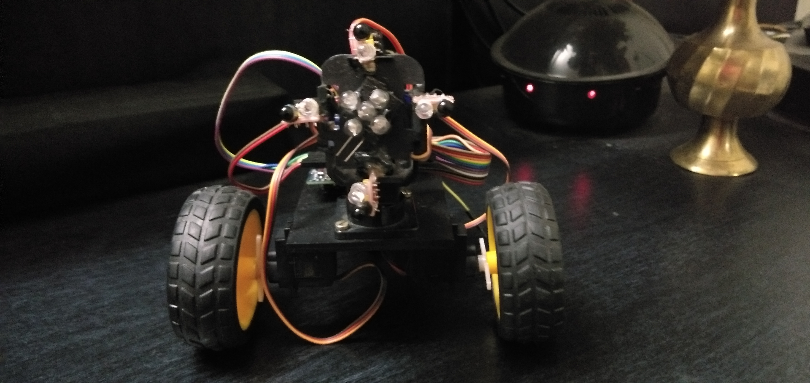

# IR-object-tracking-robot
## The robot is based on an infrared sensor that, with a minimum of programming, knows if the object, moving ahead, is going up, down, right or left.

### inspired : When I saw the “Mr. General” robots , I loved it. I thought it is “expressive”, a skill difficult to find in a robot built at home. So I built my version of  Mr.General with Arduino.

# ok What the robot does? 

### It is a diffident robot. It waits until an an object is in front. Then it starts, follows the object moving in front of him, looking like a good robot, trying to keep the right distance from the object. if the object goes too close, the robot runs away, when if the object goes away, the robot begins to chase.
Here the robot in action:

### materials of this build in indian rupees :

.png)
